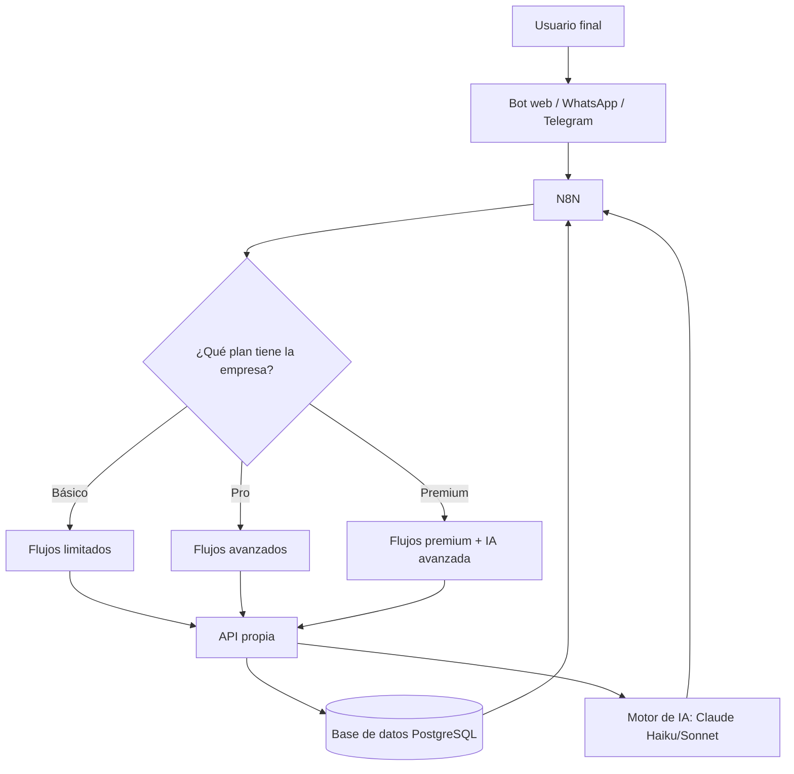

# Roadmap de Desarrollo — Agente Comercial Inteligente (Multirubro)

## 🔥 Visión General
Este roadmap integra:
1. La capacidad de operar como **agente comercial inteligente multirubro**.
2. La escalabilidad necesaria para evolucionar hacia un **SaaS multiempresa y multiplan**.

## Definicion de SaaS : (Software como Servicio) es un modelo de distribución de software basado en la nube donde las aplicaciones se ofrecen a través de Internet, permitiendo a los usuarios acceder a ellas mediante un navegador web o app, en lugar de instalarlas localmente, pagando una suscripción y sin preocuparse por el mantenimiento, la infraestructura o las actualizaciones, que gestiona el proveedor. 

---

## 🧩 Fase 0 – MVP (Ya implementado para rubro Inmobiliario)
- N8N cloud (Render).
- JSON como base de datos inicial.
- Cloudinary para imágenes.
- IA con Claude (Haiku + Sonnet).
- Bot de contacto por Widget en Web.
- Flujo básico de consultas: filtrado → respuesta → contacto.
- Manejo de errores basicos.
- Leads de contacto por Telegram.
- Sin base de datos real aún.
- Propósito: validar con 1–2 clientes reales.

---

## 🚀 Fase 1 – Migración a arquitectura escalable
### Objetivos:
- Preparar todo para escalar a múltiples rubros.
- Sentar bases de un SaaS administrable y mantenible.

### Acciones:
- Migración a **Render Basic** (o Railway).
- Implementar **base de datos real** (PostgreSQL).
- Esquema multiempresa:
  - Tabla `empresas`
  - Tabla `planes`
  - Tabla `usuarios`
  - Tabla `propiedades` / `productos` / `servicios` según rubro (estructura flexible)
- API propia (FastAPI o Node).
- N8N pasa a conectarse a la API y no directamente a archivos.

### Beneficio:
Tu bot deja de ser “para inmobiliarias” y pasa a ser **multirubro**, agnóstico, escalable.

---

## 🧠 Fase 2 – Agente Inteligente Multirubro
### Integración completa con IA:
- Filtro de datos con Haiku.
- Lenguaje natural profesional con Sonnet.
- Permitir “adaptadores de rubro”:
  - Inmobiliaria
  - Consultorio médico
  - Escuela
  - Venta de autos
  - E-commerce
  - Hotelería
- Cada rubro puede tener estructuras distintas, pero la API provee un “modelo estándar de consulta”.

Ejemplo:
```json
{
  "titulo": "Departamento 2 ambientes",
  "categoria": "inmueble",
  "precio": 120000,
  "ubicacion": "Caballito",
  "atributos": {
    "ambientes": 2,
    "expensas": 45000
  }
}
```

---

## 💼 Fase 3 – SaaS Multiempresa
### Elementos a implementar:
- Login multiempresa.
- Panel de administración.
- Configuraciones por plan:
  - Límite de consultas.
  - Canal habilitado (web/telegram/wa).
  - IA profesional incluida o no.
  - Cantidad de productos/datos permitidos.
- Facturación:
  - Stripe
  - MercadoPago Subscriptions

---

## 🤖 Fase 4 – Bot omnicanal
### Canales soportados:
- Web widget
- Telegram
- WhatsApp Business API
- Instagram DM
- Facebook Messenger
- Chat embebido para cualquier página

Todos consumiendo la **misma API**.

---

## 🛠️ Fase 5 – Panel del Cliente (Dashboard)
Funcionalidades:
- Alta/baja/modificación de productos/propiedades/servicios.
- Ver leads generados.
- Historial de conversaciones.
- Estadísticas:
  - Preguntas más frecuentes.
  - Horarios de mayor actividad.
  - Conversiones (contactos generados).

---

## 💎 Fase 6 – Marketplace de Plantillas
Cada empresa puede activar “plantillas inteligentes”:
- Inmobiliaria: tasaciones, citas, visitas programadas.
- E-commerce: catálogo, stock, automatización de ventas.
- Salud: turnos, prepaga, análisis.
- Hoteles: reservas, disponibilidad, consultas rápidas.

Tu producto deja de ser un bot → pasa a ser **“AI Business Automation Platform”**.

---

## 🎯 Conclusión
Con este roadmap, tu desarrollo:
- Escala a **cualquier rubro** sin cambios en la estructura central.
- Se convierte en un **SaaS profesional**, cobrable por suscripción.
- Te permite vender planes y administrar empresas desde un backend único.

---

# 📊 Diagrama General del Bot Multiplan


---

Fin del documento.
